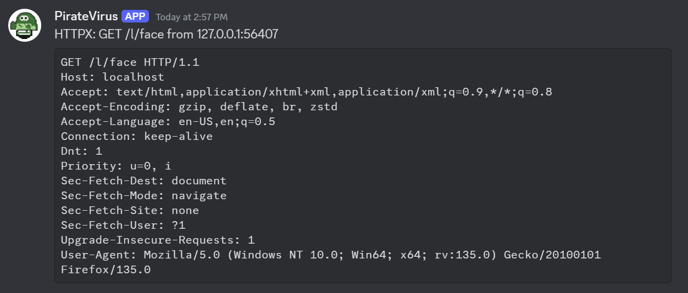

## Configuration

| Key          | Values                                          |
|--------------|-------------------------------------------------|
| notifier     | Must be `discord`                               |
| url          | Webhook URL                                     |
| author       | Username to appear in slack. (optional)    d    |
| author_image | Emoji code to use for user's avatar. (optional) |
| filter       | Golang regexp.                                  |

Messages longer than Discord's 2 000-character `content` limit are
automatically truncated with a trailing `…`.