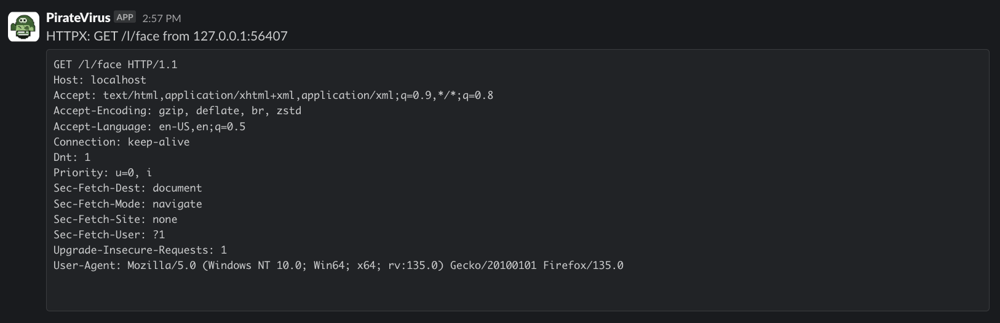

## Configuration

| Key          | Values                                             |
|--------------|----------------------------------------------------|
| notifier     | Must be `slack`                                    |
| url          | Webhook URL                                        |
| author       | Username to appear in slack. (optional)            |
| author_image | Emoji code to use for user's avatar. (optional)    |
| channel      | Channel to post to, can be a user's ID. (optional) |
| filter       | Golang regexp.                                     |

Messages longer than ~3 900 characters are automatically truncated with
a trailing `…` to keep Slack from splitting them across multiple posts.

